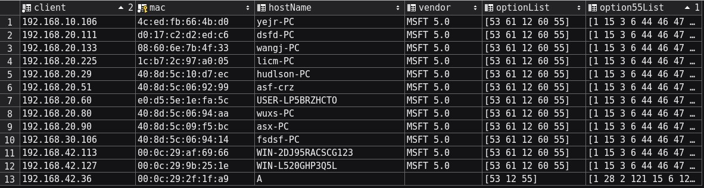
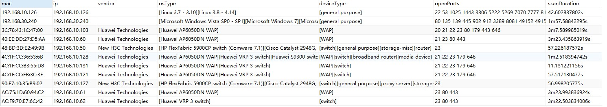

# Gofinger
Gofinger is passive device fingerprint project written by go.  
It is under development.

## Introduce
The amid of device fingerprint is device identify.  There are many ways to get device fingerprint ,and my focus is to use the message spread in the 
network . Many delicious information are spread with the TCP/IP network,if you can 
find them, it may be great help to get a fingerprint. In my case, I will use the DHCP and HTTP packet to gain fingerprint.

# Requirement
Build gofinger requires libpcap-dev and cgo enabled.
## libpcap
for ubuntu/debian:

```sh
sudo apt install libpcap-dev
```

for centos/redhat/fedora:

```sh
sudo yum install libpcap-devel
```

## Usage
Run command below , you can get the fundamental capacity of goprinter
```shell script
go run main/main.go \
    -h [host_name_of_mysql] \
    -u [user_name_of_mysql] \
    -p [password_of_user] \
    -db [database_name]       
```
or run with argument
```shell script
go run main/main.go \
    -i interfaceName\
    -f filter \
    -h [host_name_of_mysql] \
    -u [user_name_of_mysql] \
    -p [password_of_user] \
    -db [database_name]
```
## Output
Output can be access from four place. first is in the terminal itself, second is in mysql database, third can be assess through http ,fourth is in redis
### terminal
```shell script
# ./main 
pcap version:  libpcap version 1.5.3
InterFace  ens33 with ip address 192.168.174.158 Found 
InterFace  ens37 with ip address 192.168.42.36 Found 
Capture DHCP FingerPrint on Interface: ens37
Capture DHCP FingerPrint on Interface: ens33
---------------------------------------------------------------
HTTPingerPrint
IP       : 192.168.174.158
Mac      : 00:0c:29:2f:1f:9f
UserAgent: Monit/5.25.1
Host     : www.hao123.com
Cookie   : 
OS       : 
--------------------------------------------------------------------
DHCPFingerPrint
client       :192.168.42.36
mac          :00:0c:29:2f:1f:a9
hosName      :A
vendor       :
optionList   :[53 12 55]
option55List :[1 28 2 121 15 6 12 40 41 42 26 119 3 121 249 33 252 42]
```
### mysql


### http
```shell script
# curl http://localhost:9010/ID=1
{
   "client": "192.168.42.36",
   "mac": "00:0c:29:2f:1f:a9",
   "hostName": "A",
   "vendor": "",
   "optionList": "NQw3",
   "option55List": "ARwCeQ8GDCgpKhp3A3n5Ifwq"
}
```

### redis
```shell script
[root@A amd64]# redis-cli
127.0.0.1:6379> keys GoMac*
 1) "GoMac.e0:d5:5e:26:56:f5"
 2) "GoMac.40:8d:5c:06:94:aa"
 3) "GoMac.18:31:bf:ca:77:26"
 4) "GoMac.00:0c:29:9b:25:1e"
 5) "GoMac.40:8d:5c:10:d7:ec"
 6) "GoMac.00:0c:29:21:d2:a0"
 7) "GoMac.e0:d5:5e:1e:fa:5c"
 8) "GoMac.4c:ed:fb:66:4b:d0"
 9) "GoMac.18:31:bf:ca:77:42"
10) "GoMac.ac:e0:10:e9:1e:24"
11) "GoMac.00:0c:29:2f:1f:a9"
12) "GoMac.40:8d:5c:06:92:99"
13) "GoMac.08:60:6e:7b:4f:33"
14) "GoMac.40:8d:5c:06:94:14"
15) "GoMac.1c:b7:2c:97:a0:05"
16) "GoMac.d0:17:c2:d2:ed:c6"
127.0.0.1:6379> hgetall "GoMac.e0:d5:5e:26:56:f5"
 1) "dhcp.IP"
 2) "192.168.30.218"
 3) "dhcp.hostName"
 4) "tipray-PC"
 5) "dhcp.vendor"
 6) "MSFT 5.0"
 7) "dhcp.optionList"
 8) "[53 61 12 60 55]"
 9) "dhcp.option55List"
10) "[1 15 3 6 44 46 47 31 33 121 249 43 252]"
```
# OsScan
OsScan is a subproject of gofinger, the purpose of it is to guest the Operation System and Device Type of remote device.

## Requirement
To use OsScan , nmap should be installed first

for debiaan:
```shell script
rpm -vhU https://nmap.org/dist/nmap-7.80-1.x86_64.rpm
```

## Usage
```shell script
go run osScan/osscan.go \
    -si [interfaceName] \
    -h [host_name_of_mysql] \
    -u [user_name_of_mysql] \
    -p [password_of_user] \
    -db [database_name]
```
```shell script
go run osScan/osscan.go \
    -f [filePath] \
    -h [host_name_of_mysql] \
    -u [user_name_of_mysql] \
    -p [password_of_user] \
    -db [database_name]
```

## OutPut
The result of OsScan will be saved in mysql database. If you  set -db option when running osScan, data will be saved in database_name,with the table named "osscan".
 
